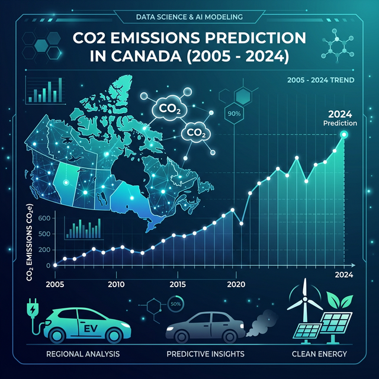

# CO2 Emissions Prediction - Canada (2005-2024)



This project uses historical data of vehicles sold in Canada between 2005 and 2024 to predict CO2 emissions (g/km) based on technical specifications such as engine size, number of cylinders, transmission type, and fuel consumption.

## 📊 Project Objective

Develop a regression model capable of accurately estimating the carbon footprint of light vehicles, facilitating the analysis of energy efficiency and the environmental impact of different vehicle categories and fuel technologies.

## 🗂️ Project Organization

```text
├── data                <- Data files (original CSVs and processed Parquets)
├── models              <- Trained serialized models (.joblib)
├── notebooks           <- Experiments and exploratory analyses
│   ├── 01-el-bases.ipynb         <- Data consolidation and initial cleaning
│   ├── 02-el-eda.ipynb           <- Exploratory Analysis and Processing
│   ├── 03-el-models.ipynb        <- Model Training and Selection
│   └── src             <- Modularized source code
│       ├── helpers.py      <- Support functions
│       ├── config.py       <- Path configurations
│       ├── plots.py        <- Custom visualizations
│       ├── home.py         <- Streamlit application
│       └── models.py       <- scikit-learn modeling logic
├── references          <- Data dictionaries and extra documentation
└── reports             <- Generated reports and exported images
```

## 🛠️ Environment Configuration

The project uses the `uv` package manager to ensure reproducibility and performance.

1.  **Clone the repository**:
    ```bash
    git clone https://github.com/elossio/CO2_emissions.git
    cd CO2_emissions
    ```

2.  **Create and synchronize the environment**:
    ```bash
    uv sync
    ```

3.  **Environment Variables**:
    Rename the `.env.example` file to `.env` if you need to configure custom paths (optional, already configured via `config.py`).

## 🚀 How to Use

### 1. Interactive Application (Dashboard)
The easiest way to explore the data and obtain predictions is through our Streamlit application:
```bash
uv run streamlit run notebooks/src/home.py
```

### 2. Development Notebooks
To understand the details of the analysis and model training:
- `01-el-bases.ipynb`: Data loading and consolidation.
- `02-el-eda.ipynb`: Check the patterns discovered in the data and emission trends by year and manufacturer.
- `03-el-models.ipynb`: Replicate the **Ridge Regression** model training with the best set of hyperparameters.

## 🧰 Main Technologies

- **Language**: Python 3.13+
- **Processing**: Pandas, NumPy
- **Machine Learning**: Scikit-Learn, XGBoost, LightGBM
- **Visualization**: Matplotlib, Seaborn, Plotly
- **Interface**: Streamlit
- **Management**: uv

## 📄 License

This project is under the [MIT](LICENSE) license.

---
*Developed as a practical project for data analysis and predictive modeling.*

